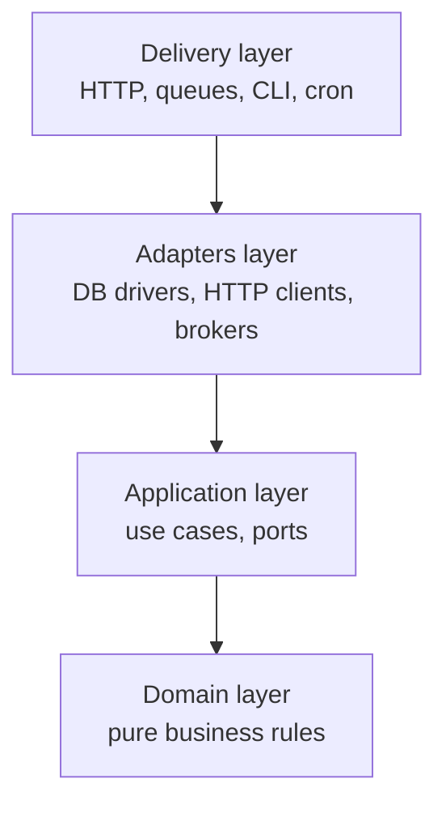

Every codebase drifts. New hires copy patterns from the worst part of the repo. Someone lands a "quick fix" that skips a test. A dependency upgrade slips through with a fresh CVE. Six months later the codebase is a museum of local decisions nobody remembers making.

You cannot prevent this with a style guide in a wiki. You cannot prevent it with a code review checklist. Humans forget, get tired, and want to ship.

You prevent it with **automation that says no on their behalf.**

Architecture is the set of decisions you make at the whiteboard. Standards are the set of decisions you encode into the machine so nobody has to remember them.

{/* truncate */}

## Decoupling Is a Guardrail, Not an Aesthetic

The single most valuable architectural constraint to enforce: **business logic must not know about the framework it runs inside.**

This is the core rule of Clean Architecture and Hexagonal Architecture, and it sounds abstract until the first time you have to migrate a codebase from Express to Fastify, or from a REST API to a queue consumer, or from Postgres to a different Postgres schema. If your business rules import `req` and `res`, or query the database directly from a controller, that migration is a rewrite. If your business rules receive plain inputs and return plain outputs, that migration is a config change.

The layout that survives every migration I have ever done:

- **Domain layer**: pure functions and types. No imports from web frameworks, no database drivers, no I/O of any kind. This is where the actual business rules live. This layer must be trivially unit-testable with no mocks.
- **Application layer**: use cases that orchestrate domain functions. Depends on the domain layer plus abstract *ports* (interfaces) for things like "save an order" or "send a notification."
- **Adapters layer**: concrete implementations of those ports. This is where the Postgres driver, the HTTP client, the SQS publisher, the email provider actually live. Swapping any of them means writing a new adapter, not touching the domain.
- **Delivery layer**: the framework glue. Express routes, Lambda handlers, queue consumers. This layer's only job is to translate an incoming request into a use case call and translate the result back.

The diagram is deliberately one-directional. Inner layers never import outer layers.



The tell that a codebase has broken this rule is easy to spot. Grep the domain folder for `express`, `postgres`, `axios`, `aws-sdk`. If any of those imports appear inside pure business logic, the guardrail is already gone. Restore it before adding one more feature.

## Linting and Formatting Are Non-Negotiable

Every project I ship has three things running before code can merge: a formatter, a linter, and a type checker. All three are enforced by CI, not by human vigilance.

- **Formatter (Prettier or Biome)**: settles whitespace, quotes, semicolons, trailing commas. Every code review that spends a single minute on style is one minute stolen from finding real bugs.
- **Linter (ESLint or Biome)**: catches accidental patterns. Unused variables, forgotten `await`, disabled tests, `console.log` left in production code. Configure it to *fail the build*, not to warn.
- **Type checker (TypeScript in strict mode)**: catches the class of bug that has no debugger. `null` where a value was expected, wrong-shape objects across module boundaries, forgotten enum branches.

The default configurations are too permissive. Turn on the strict presets, then delete the exceptions your team wants to add back. Every "temporary" lint rule disable becomes permanent, and each one is a hole you carved yourself.

## The CI Pipeline as a Production Contract

A CI pipeline is not a "run the tests" script. It is the written contract for what your team refuses to ship. If a rule matters, it lives in the pipeline. If it does not live in the pipeline, it does not matter.

The minimum pipeline I put on any project has five gates that must all pass before merge.

1. **Install with the exact lockfile.** Use `npm ci`, `pnpm install --frozen-lockfile`, or `yarn install --immutable`. Regenerating the lockfile in CI defeats the entire point of having one.
2. **Cache the dependency store.** Cold `npm install` on every push is the fastest way to make your team stop caring about CI. Cache keyed on the lockfile hash.
3. **Lint, format-check, and type-check.** All three run in parallel. Any failure blocks merge.
4. **Test with a coverage floor.** Not just "run the tests." Enforce a minimum coverage percentage and fail the job if it drops. This blocks the "I added a feature, I did not add a test" pattern before it lands.
5. **Scan for secrets and known vulnerabilities.** Every push checks for leaked credentials in the diff, and every dependency is checked against a CVE database.

Here is the shape of a pipeline that enforces all five, using GitHub Actions with pnpm and a Node project:

```yaml
name: quality-gate

on:
  pull_request:
  push:
    branches: [main]

concurrency:
  group: quality-${{ github.ref }}
  cancel-in-progress: true

permissions:
  contents: read

jobs:
  install:
    runs-on: ubuntu-latest
    steps:
      - uses: actions/checkout@v4
      - uses: pnpm/action-setup@v4
        with:
          version: 9
      - uses: actions/setup-node@v4
        with:
          node-version: 20
          cache: pnpm
      - run: pnpm install --frozen-lockfile

  static-checks:
    needs: install
    runs-on: ubuntu-latest
    strategy:
      matrix:
        check: [lint, format, typecheck]
      fail-fast: false
    steps:
      - uses: actions/checkout@v4
      - uses: pnpm/action-setup@v4
        with:
          version: 9
      - uses: actions/setup-node@v4
        with:
          node-version: 20
          cache: pnpm
      - run: pnpm install --frozen-lockfile
      - run: pnpm run ${{ matrix.check }}

  test-with-coverage:
    needs: install
    runs-on: ubuntu-latest
    steps:
      - uses: actions/checkout@v4
      - uses: pnpm/action-setup@v4
        with:
          version: 9
      - uses: actions/setup-node@v4
        with:
          node-version: 20
          cache: pnpm
      - run: pnpm install --frozen-lockfile
      - run: pnpm run test:coverage -- --coverage.thresholds.lines=80 --coverage.thresholds.branches=75

  secret-scan:
    runs-on: ubuntu-latest
    steps:
      - uses: actions/checkout@v4
        with:
          fetch-depth: 0
      - uses: gitleaks/gitleaks-action@v2
        env:
          GITHUB_TOKEN: ${{ secrets.GITHUB_TOKEN }}

  dependency-audit:
    runs-on: ubuntu-latest
    steps:
      - uses: actions/checkout@v4
      - uses: pnpm/action-setup@v4
        with:
          version: 9
      - run: pnpm audit --audit-level=high
```

A few opinionated choices in that file.

`concurrency` at the workflow level cancels older in-flight runs on the same branch. Without it, five rapid pushes queue five full builds and burn budget you do not have.

`permissions: contents: read` at the top forces the default token to be read-only. Any job that needs write access has to opt in explicitly, which makes supply-chain attacks noisier.

The static checks run in a matrix so lint, format, and typecheck fail independently. Bundling them into one job means fixing the first failure hides the next two.

The coverage thresholds are set as command-line flags, not just config, so the pipeline fails visibly when someone lowers them. Every threshold reduction should be a pull request with a written justification, not a silent config edit.

The third-party actions above are pinned to major tags (`@v4`, `@v2`) for readability. In systems that take supply-chain security seriously, pin each action to its commit SHA instead, and let Dependabot update the SHA on a review-and-merge cadence. Tag pinning trusts the maintainer's tag pointer; SHA pinning trusts a specific reviewed commit.

## Prompting Past the Boilerplate YAML

Ask AI "write a CI/CD pipeline for GitHub Actions" and you get a three-step file that builds the project and does nothing else. No caching, no coverage gate, no secret scan, no concurrency control. Ship it and every one of the five failure modes above is wide open.

Name the stack, name the target, name the guardrails. The model gives you what you asked for; ask for the whole contract:

> **Role:** DevSecOps Engineer.
> **Context:** I am deploying a [Tech Stack] application via GitHub Pages (Frontend) and [Cloud Provider] (Backend).
> **Task:** Provide a comprehensive GitHub Actions YAML workflow that enforces code quality before deployment.
> **Requirements:** The pipeline must: 1. Install dependencies efficiently using caching. 2. Run code linters and formatters. 3. Run unit tests and fail if coverage is below [X]%. 4. Scan for exposed secrets/vulnerabilities.

What comes back is a real pipeline you iterate on, not a hello-world scaffold you rewrite twice before it hits main.

## The Rule

Every rule you care about must exist in exactly one place: **an automated check that blocks merge.**

If it lives in a wiki, it does not exist.
If it lives in a Slack message, it does not exist.
If it lives in your head, it definitely does not exist.

Automate the standard, or accept that the standard is optional. There is no third choice.
