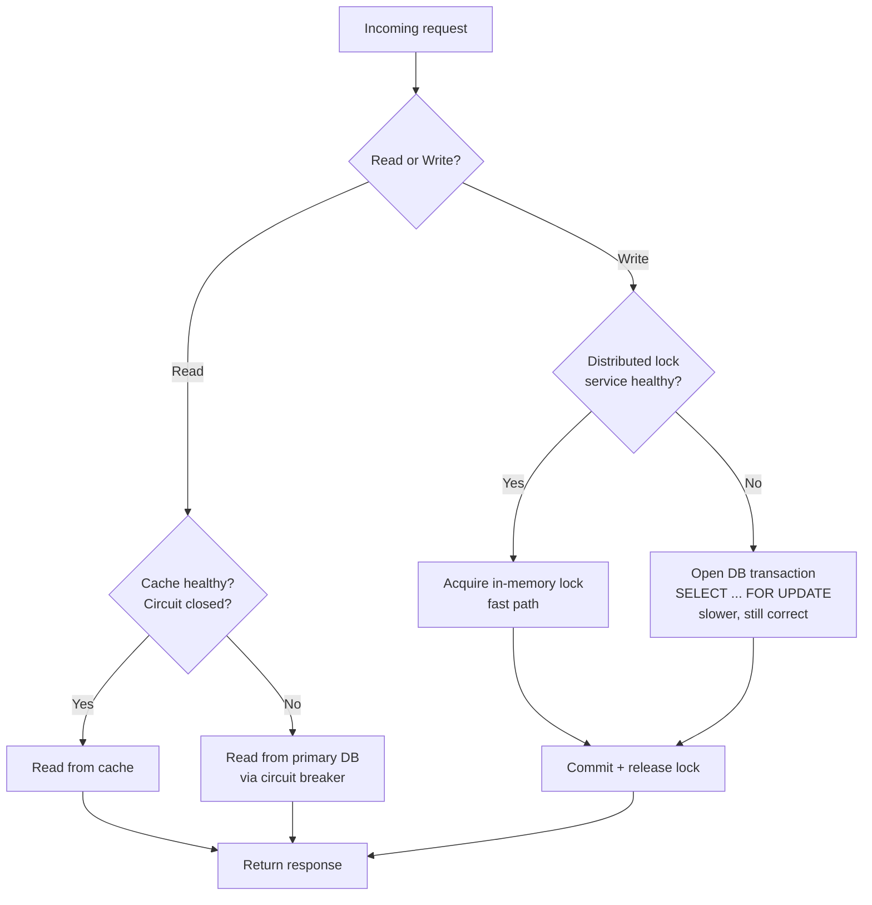

Every system in production fails. Not "might fail." *Fails.* The database goes unreachable. The cache tier crashes. A third-party API returns garbage for six minutes. A deploy silently corrupts state.

The question was never *whether* the system would fail. The question is: **does the failure become a silent degradation, or does it take the whole company offline?**

That answer is decided at architecture time, not at incident time. By the time the pager goes off, the shape of your outage is already fixed.

{/* truncate */}

## Section 1: Greenfield vs. Brownfield Failure Modes

Before you talk about resiliency patterns, you have to know which situation you are actually in. The failure modes of a system built from scratch are the opposite of the failure modes of a system you inherited.

In **greenfield**, your risk is **premature complexity**. Nothing is on fire yet, so it is tempting to install every distributed-systems toy you have read about. Kubernetes for a landing page. Kafka for 200 events per day. A message queue in front of a database that never gets hot. You are pre-paying for scale you may never need, and every added layer becomes a permanent failure surface. The classic greenfield outage is: "Redis went down and took the site with it, but we did not actually need Redis."

In **brownfield**, your risk is **cascade failure**. Real users depend on the current behavior. A "small" upgrade to a logging library flips a peer dependency, silently downgrades a transitive package, and takes down the checkout flow. The classic brownfield outage is: "We updated one library and three unrelated services stopped working."

The playbook flips depending on which situation you are in.

| Dimension            | Greenfield                                               | Brownfield                                                          |
| -------------------- | -------------------------------------------------------- | ------------------------------------------------------------------- |
| Primary risk         | Over-engineering, premature abstraction.                 | Regression, hidden transitive dependencies, silent behavior drift.  |
| Failure profile      | New components fail because they were never needed.      | Existing components fail because assumptions shifted underneath them. |
| Dependency policy    | Add only what a real user story requires.                | Justify every version bump against a changelog and a rollback plan.  |
| Testing focus        | Contract tests around future boundaries.                 | Characterization tests that lock in current behavior before you touch it. |
| Deployment cadence   | Fast, small, frequent. Build the deploy muscle early.    | Small, reversible, gated by feature flags.                          |
| Refactor strategy    | Refactor freely, no users to protect.                    | Strangler-fig pattern. Never rewrite in place.                      |
| Success metric       | Time to first real user.                                 | Zero-regression deploys.                                            |

The tell for a bad decision in either mode is the same: the person proposing the change cannot articulate what will get **worse** if they do it. If everything is upside, they have not thought about it long enough.

## Section 2: The Third-Party Failure You Will Actually Hit

Pick any real production system. It depends on at least one thing you do not control. A cache, a queue, a payment provider, an auth service, a database managed by someone else. That thing will fail. Not maybe. *Will.*

The most common version of this outage in the systems I have run is a Redis failure. Redis is a beautiful piece of software, but people architect around it as if it cannot go down. Then it goes down.

Here is what actually happens if you have not planned for it.

**Read path with no fallback:** Your app calls Redis. Redis is unreachable. The call blocks or throws. Every incoming request now waits on a broken cache. Connection pools fill up. Threads pile up. Your primary database still works fine, but nothing is reaching it because the app is stuck upstream. **Cache outage becomes a full site outage in about 90 seconds.**

**Write path with no fallback:** You were using Redis for distributed locking (say, "only one worker can process this order at a time"). Redis dies. Two workers now process the same order. You have just double-charged a customer, or double-shipped an item, or created two conflicting rows with different IDs. **Cache outage becomes a data integrity incident.**

Both of these are architecture problems, not code problems. You cannot fix them with a try/catch after the fact. You have to design the fallback before the outage happens.

## Section 3: The Two Fallbacks

**Read fallback: cache miss becomes database read, gated by a circuit breaker.**

When the cache is healthy, you read from it. When the cache errors, you fall through to the primary database. That much is obvious. The non-obvious part is that if you *just* fall through, your database gets slammed by every request that would have hit the cache, and the database dies next. That is called a cache stampede, and it is how cache outages become database outages.

The fix is a **circuit breaker** wrapping the fallback path. The circuit breaker tracks recent failures. When the failure rate crosses a threshold, it "opens" and short-circuits every subsequent call for a cooldown period, returning either a cached-last-known-good response or a deliberate error. Your database sees a controlled trickle instead of a flood.

Three states. Closed = calls flow normally. Open = calls fail fast without touching the failing dependency. Half-open = after a cooldown, let a small number of calls through to test whether the dependency has recovered. If they succeed, close. If they fail, re-open.

**Write fallback: memory locks become database row locks, accepting slower throughput to preserve correctness.**

When your distributed lock lives in Redis and Redis dies, you do not disable locking. You switch to the database's native locking. In Postgres or MySQL, that means opening a transaction and using `SELECT ... FOR UPDATE` to acquire a row-level lock on the record you are about to modify. Any other worker attempting the same lock will block until you commit or roll back.

This is slower. That is fine. **Correctness is a hard constraint. Speed is a soft one.** During an outage, you shed throughput to keep the ledger straight. When Redis comes back, you flip the switch back.

## The Fallback Flow

Notice what the diagram enforces: there is no path from a failing dependency to a failed request. Every branch has a next step. That is the whole idea of resilient design. **Failure is a routed condition, not an exception.**

## Do Not Ask AI How to Fix a Redis Down Error

The worst thing you can do at 3 a.m. is ask a model how to handle a Redis outage. What you get back is a `try { redis.get() } catch { return null; }` snippet that hides the failure and returns wrong data to real users. That is not resiliency. That is a bug you shipped on purpose.

The prompt that actually helps:

> **Role:** Chaos Engineer and Systems Architect.
> **Context:** I have a [Language/Framework] backend using Redis for [Caching / Distributed Locking]. The primary database is [Database Type].
> **Task:** Walk me through a failure mode and effects analysis (FMEA) for when Redis becomes completely unreachable. Provide:
> 1. The immediate architectural impact on users.
> 2. A pseudo-code implementation of a Circuit Breaker pattern to mitigate it.
> 3. How to verify data consistency during the outage.

It names the dependency, demands impact analysis before code, and requires a verification step. The output is an architectural response, not a swallowed exception.

## Two Questions Per Dependency

For every third-party service your system talks to, answer these on paper before you ship:

1. **What is the correct behavior when this dependency is completely unreachable?**
2. **What is the correct behavior when this dependency returns wrong data slowly?**

If you cannot answer both, that dependency is not covered by your architecture. It is covered by hope. Hope is what makes a 3 a.m. page feel like a natural disaster instead of a routine event.
