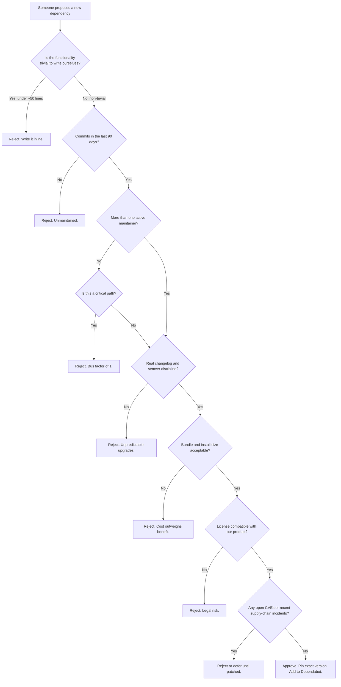

Every dependency you add is a bet. You are betting that a stranger will keep maintaining their code, will not push a breaking change under a patch version, will not get compromised, and will still exist in two years when your production system depends on it.

Most teams treat it like paperwork. They `npm install` on a Stack Overflow recommendation and ship. Then something breaks in production at 3 a.m., and the postmortem reads "transitive dependency updated." That is not bad luck. That is skipped diligence.

The earlier post in this series covered the first-order architecture decisions (topology, repo layout, framework family). This post picks up where those leave off: once the framework family is chosen, every additional package you add to it is a fresh risk decision.

Choosing a tech stack is a risk management exercise. Here is how I do it.

{/* truncate */}

## The Package Selection Matrix

Before I run `npm install anything`, the package has to pass this checklist. Every item is a "no ship" if it fails.

**1. Is it actively maintained?**

Open the repository. Look at the commit history. A healthy package has commits in the last 90 days. Not a version bump, not a README tweak, real commits. Then look at open issues. If the issue tracker has hundreds of open bugs with no maintainer response for months, you are adopting an orphan.

**2. What is the bus factor?**

Count the humans who have merged pull requests in the last year. If the answer is one, you are trusting a single person's attention. Fine for a hobby project. Not fine for a payment processor.

**3. What does the changelog look like?**

Packages with disciplined changelogs (real semver, real release notes, real migration guides) are run by people who respect their users. Packages with "misc improvements" as their entire changelog are run by people who will surprise you.

**4. What is the actual weight?**

Look up the install size and the runtime bundle size on `bundlephobia.com` or `packagephobia.com`. A 200 KB dependency for a function you could write in 20 lines is not a saving. It is a cost you will pay on every page load, forever.

**5. What is the license?**

MIT, Apache 2.0, BSD are safe. GPL and AGPL have real legal implications for closed-source products. "No license" means legally you cannot use it at all. Do not guess. Read it.

**6. What is the security posture?**

Run `npm audit` before adopting. Check whether the package is enrolled in Dependabot or Renovate. Check whether it has any CVEs open. If it has ever had a supply-chain incident (typosquat, compromised maintainer token), read the postmortem before continuing.

If a package passes all six, it is a candidate. If it fails even one, you either write the code yourself, pick a different package, or accept the risk in writing.

## Version Pinning Is Not Optional

The default behavior of `npm install <package>` is to write a caret range to your `package.json`:

```json
{
  "dependencies": {
    "some-library": "^1.4.2"
  }
}
```

That caret means "any 1.x version at or above 1.4.2 is fine." On your laptop today, it resolves to 1.4.2. On a fresh clone next month, it might resolve to 1.9.7. Your production build now contains code you have never tested, written by someone you have never met, released after your last successful deploy.

This is the mechanism behind roughly half the "it worked yesterday" outages I have debugged. A transitive dependency drifts, a peer resolution flips, and behavior changes without a single line of your code being touched.

Two things fix it.

**First**, always commit your lockfile (`package-lock.json`, `pnpm-lock.yaml`, `yarn.lock`). The lockfile is the source of truth for what actually gets installed. If your CI is not running `npm ci` (which respects the lockfile exactly) instead of `npm install` (which can regenerate it), you have already lost.

**Second**, tell npm to stop writing loose ranges in the first place. Add an `.npmrc` at the root of your project:

```ini
save-exact=true
package-lock=true
engine-strict=true
```

With `save-exact=true`, `npm install <package>` writes `"1.4.2"` instead of `"^1.4.2"`. Every dependency added from now on is pinned to the exact version you tested. Upgrades become an explicit action you take, not a passive drift you discover in production. `package-lock=true` refuses to disable the lockfile. `engine-strict=true` refuses to install if the developer's Node version does not match `engines` in `package.json`, catching "works on my machine" before it merges.

Combined with a Dependabot or Renovate config that opens a pull request per version bump, you get the best of both worlds: stable production and visible upgrade decisions.

## The Decision Tree

This is the flow I follow every time someone (including me) proposes adding a dependency:



Notice how many exit ramps this tree has before "approve." That is the point. **Adding a dependency is a decision that should be uncomfortable.** If it is easy, you are not doing the diligence.

## Prompting Past the Popularity Contest

Ask AI "what is the best library for handling state management?" and you get whichever library has the most blog posts about it. Popularity does not correlate with production readiness. It correlates with how loud the launch marketing was.

Make the model do the audit *you* would do. Two concrete options, the dimensions from the checklist above, a recommendation biased toward your team's priority.

**Weak prompt:**

> What is the best library for handling state management?

**Structured prompt:**

> **Role:** Open Source Security & Maintainability Auditor.
> **Context:** I am choosing between [Option A] and [Option B] for [Core Functionality] in a production app.
> **Task:** Create a comparison table analyzing both options across 4 dimensions: Bundle Size/Performance, Ecosystem Longevity, Community Maintenance Health, and Common Failure Modes.
> **Output:** Conclude with a clear recommendation based on a team that prioritizes [Long-term stability OR Cutting-edge speed].

What comes back is something you can defend in a design review, not something you copy off a blog.

## The Rule

Every package in your `package.json` is a name you are willing to see in a postmortem. If you would not defend the choice under that pressure, do not install it.

Pin your versions. Read your changelogs. Count your maintainers. Ship less than you think you need.

That is how you build a stack that does not surprise you.
