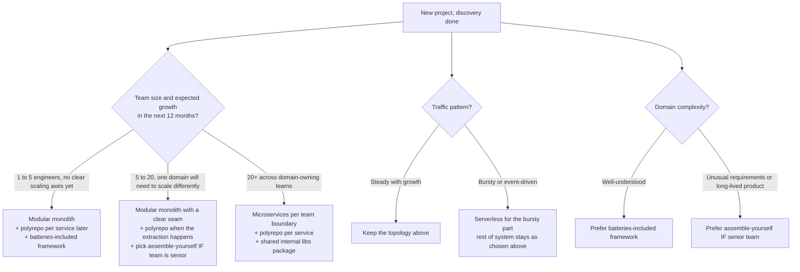

By the time you have a user, a critical path, and a workload profile, three architecture decisions are already staring at you. Each of them constrains everything after it. Each of them is famously miscalled by people copying whatever a big-tech blog post recommended last quarter.

The three decisions:

1. **Deployment topology.** Monolith, modular monolith, microservices, or serverless.
2. **Repo layout.** Monorepo, polyrepo, or multi-repo with shared packages.
3. **Framework family.** Batteries-included, assemble-yourself, or a specific language ecosystem.

They are orthogonal. You can mix them in any combination, and most successful teams end up in a very small subset of the combinations. This post is about picking that subset deliberately, with impact tables you can defend in a design review.

{/* truncate */}

## Deployment Topology

The choice you make here decides how much operational work you take on, how fast you can ship, and how large a blast radius any single bug has.

| Dimension                    | Monolith                                     | Modular Monolith                                         | Microservices                                                  | Serverless                                                    |
| ---------------------------- | -------------------------------------------- | -------------------------------------------------------- | -------------------------------------------------------------- | ------------------------------------------------------------- |
| Team size that fits          | 1 to 5 engineers.                            | 5 to 20 engineers, or 1 to 5 with future growth in mind.  | 20+ engineers across multiple domain teams.                     | 1 to 10 engineers building bursty or event-driven workloads.   |
| Deploy velocity              | Highest. One deploy artifact.                | High. One artifact, clear internal boundaries.            | Slower per change (each service has its own pipeline).           | Fast per function; complex when functions coordinate.          |
| Ops complexity               | Low. One process, one database usually.      | Low-to-medium. Same runtime, still one deploy.            | High. Service discovery, distributed tracing, cross-cutting infra. | Medium. Provider owns runtime; you own event topology.         |
| Blast radius of a bug        | Wide. A crash takes the whole app down.       | Medium. Wide unless modules are strictly isolated.        | Narrow *if* boundaries are correct. Wide if they leak.           | Narrow per function; wide if a shared dependency (auth) fails. |
| Cost at low scale            | Low. One machine.                            | Low. One machine.                                          | High. Every service costs baseline infra even at idle.           | Very low at idle. Can be expensive at sustained high scale.    |
| Cost at high scale           | Can be efficient with vertical scale.        | Efficient. Scale bottlenecks are visible per module.       | Efficient *if* services are correctly split by scaling axis.     | Depends on invocation pattern. Cold starts can bite.           |
| Hiring pool                  | Any web developer.                            | Any web developer with modular design sense.               | Requires distributed-systems experience for at least a few seniors. | Requires cloud-provider-specific expertise.                    |
| Debuggability                | Excellent. One stack trace.                   | Excellent. One process; boundaries visible in code.        | Hard. Failures span services; requires distributed tracing.       | Hard. Vendor logs; local reproduction is painful.               |
| Right call when              | Early-stage products; small teams; unclear domain. | Growing products with more than one domain but a small team. | Multiple teams with genuinely independent scaling axes.          | Bursty, event-driven, or unpredictable traffic; low-ops appetite. |
| Wrong call when              | You need independent deploys per domain.      | You need language-per-team or true isolation.              | Team is small; domain boundaries are unclear; ops budget is thin. | Traffic is steady and high; latency budget is tight.           |

The pattern I have seen work most often: **start with a modular monolith. Extract a service only when there is a concrete reason.** "We might scale later" is not a concrete reason. "Team A cannot deploy without waiting for team B," or "billing needs a 20x CPU budget the rest of the app never uses" is.

Microservices are not a scaling pattern. They are an **organizational** pattern. If you have one team, you almost certainly do not need them.

## Repo Layout

Independent of topology, you have to decide how many git repos your team lives in. This one is culture-shaping.

| Dimension                       | Monorepo                                                       | Polyrepo (repo per service)                                   | Multi-repo with shared packages                             |
| ------------------------------- | -------------------------------------------------------------- | ------------------------------------------------------------- | ----------------------------------------------------------- |
| Cross-cutting refactor cost     | Very low. Rename a symbol everywhere in one commit.             | Very high. Coordinated PRs across repos.                       | Medium. Coordinated release of the shared package.           |
| Dependency management           | Single lockfile. Version alignment enforced by tooling.         | Every repo pins its own versions. Drift is normal.             | Shared package pins; consumers can pin different versions.   |
| CI complexity                   | High to set up well (needs affected-graph tooling like Nx / Turborepo / Bazel). | Low per repo. High overall (many pipelines to maintain).       | Medium. Package repo needs a real release process.           |
| Discoverability                 | Excellent. Everything is `grep`-able.                          | Poor. You have to know which repo has what.                    | Medium. Depends on how well the package boundaries are documented. |
| Onboarding                      | One clone. One install.                                        | Many clones. Setup docs get stale fast.                        | Manageable. New devs learn the shared package first.         |
| Release coordination            | Trivial for internal changes; hard for public APIs.            | Independent per repo. Requires contract discipline.            | Requires a real semver policy on the shared package.         |
| Tooling maturity requirement    | High. Cold builds on huge monorepos are painful without tuning. | Low. Any git host works.                                       | Medium. Needs a package registry (npm private, GitHub Packages, etc.). |
| Right call when                 | One team; strong tooling; heavy cross-cutting refactoring.      | Independent teams with clear ownership boundaries.             | Small number of truly shared cross-service concerns (auth, logging). |
| Wrong call when                 | Tooling investment is not on the roadmap.                       | You constantly need to change the same code in every repo.     | The shared package becomes a coupling point everyone changes at once. |

The default I reach for on a small-to-medium team is **polyrepo per deployable service, with one shared "internal libs" package for genuinely cross-cutting code** (typed API clients, logging setup, error types). Monorepos are powerful, but the tooling tax is real, and teams under 10 engineers rarely have the appetite for it.

Note the interaction with topology: a modular monolith is naturally one repo. Microservices with strict polyrepo are the highest-coordination-cost combination out there. If you are running microservices in a polyrepo layout, either your contract testing needs to be excellent (see the resiliency post), or you should reconsider the layout.

## Framework Family

The framework decision is where teams most often confuse "what I like" with "what fits the team."

| Dimension                       | Batteries-Included (Rails, Django, Nest, Laravel)              | Assemble-Yourself (Fastify + Prisma + Zod + ...)             | Language-Ecosystem Choice (Go stdlib, Elixir/Phoenix, etc.)    |
| ------------------------------- | -------------------------------------------------------------- | ------------------------------------------------------------- | -------------------------------------------------------------- |
| Time to first shipped feature   | Fastest. Auth, ORM, routing, migrations all included.           | Slower. You wire each concern yourself.                        | Depends on ecosystem maturity for your workload.                |
| Convention density              | High. "The Rails way" tells you where every file goes.          | Low. Every team invents its own layering.                      | Medium. Language culture provides some conventions.             |
| Lock-in risk                    | High. Migrating off is a rewrite.                              | Low. Swap Fastify for Hono in a week.                          | High for the language; low for individual libraries.           |
| Evolvability                    | Constrained by the framework's release cadence.                 | Excellent. Upgrade or replace any layer independently.         | Constrained by the language and ecosystem maturity.             |
| Hiring pool                     | Broad for popular frameworks; narrow for niche ones.            | Broad, but candidates must be senior enough to hold opinions.  | Depends on the language. Go is broad; Elixir is deep-but-narrow. |
| Consistency across the codebase | Enforced by the framework.                                     | Requires discipline. Multiple styles emerge without it.        | Enforced by language culture (Go) or not (JavaScript).          |
| Total cost of ownership         | Low early; can spike if you outgrow the framework's assumptions. | Higher early; flatter over years.                              | Depends on ecosystem support for your specific domain.          |
| Right call when                 | Small team; well-understood domain; speed to market matters most. | Team is senior; product will live for many years; unusual requirements. | The workload strongly favors a specific runtime (concurrency, latency, memory). |
| Wrong call when                 | Your requirements consistently fight the framework's opinions.   | Team is junior or heterogeneous; no time to enforce standards.  | You pick the language for résumé reasons, not workload reasons. |

The pattern that burns teams most often: **choosing "assemble yourself" without the senior bench to enforce consistency.** Four different validation libraries, three different HTTP client styles, no shared conventions. The framework's opinions exist precisely to save you from that fate.

Conversely, teams that pick batteries-included and try to fight it end up worse off than teams that leaned in. If you find yourself constantly working around Rails or Django, the answer is usually "you picked the wrong framework," not "let's monkey-patch."

## The Decision Tree

For most projects, three questions decide 90% of the choice.

The tree does not produce a single answer. It produces a starting position, which is what a good architecture decision looks like: a defensible starting point plus a written trigger for when to change it.

## The Default, and the Written Reasons to Deviate

For a team under 10 engineers building a new product, the written default is:

- **Topology:** Modular monolith, deployed as one artifact, with strict internal module boundaries (one folder per bounded context, no cross-imports without an explicit port).
- **Repo:** Polyrepo *later* if the monolith ever splits. Until then, single repo.
- **Framework:** One batteries-included framework in the team's dominant language. No mixing.

You are allowed to deviate. You just have to write down why, in one sentence per deviation, and get sign-off from at least one other senior engineer.

Deviations that hold up in a design review:

- "We picked microservices from day one because the ML inference service needs GPUs and the rest of the system cannot afford them idle."
- "We picked a monorepo because we ship a public SDK plus a web app plus three internal tools, and cross-cutting refactors happen weekly."
- "We picked assemble-yourself Fastify + Prisma because the team's dominant language is TypeScript, three senior engineers will hold the line on conventions, and Nest's decorator style did not match our testing approach."

Deviations that collapse under one:

- "We picked microservices because it's the modern way." (Team of four. Two of them quit within a year.)
- "We picked a monorepo because Google uses one." (No Nx / Turborepo tuning. Cold CI builds took 40 minutes.)
- "We picked assemble-yourself because a batteries-included framework felt limiting." (Team of eight juniors. Every PR reinvented a middleware layer.)

The common thread: successful deviations name a *specific constraint* that the default cannot handle. Failed deviations name a *preference* or a *trend*.

## Using AI Without Getting "It Depends"

Ask an AI "should we use microservices?" and you get an it-depends answer that carefully avoids committing to anything. That is not architecture advice. That is a hedge.

The fix is to make the model take a position, and to constrain it to justify the position with structural signals, not fashion.

**Weak prompt (produces hedging):**

> Should we use microservices?

**Structured prompt (produces a defensible recommendation):**

> **Role:** Principal Engineer advising on system topology.
> **Context:** Team size: [X] engineers. Expected first-year users: [Y]. Deployment target: [Cloud / on-prem]. Domains that must scale independently: [List, or "none yet"]. Current pain points (if any): [List].
> **Task:** Recommend one topology (monolith / modular monolith / microservices / serverless) and one repo layout (monorepo / polyrepo). For each, list (a) what breaks first at 2x scale, (b) hiring pool implications, and (c) the specific signal that would justify moving to the next topology.
> **Constraint:** Do not recommend microservices without naming at least two independent scaling axes that justify the split.

The last constraint is the important one. It forces the model to justify a fashionable answer with a real reason, which is the same test you should apply to any human proposing the same thing.

## The Rule

Every one of these three decisions has a boring default that is right for most teams:

- **Modular monolith**, extracted only when a specific service needs to scale differently.
- **Polyrepo per deployable**, extracted only when a monolith splits.
- **One batteries-included framework**, chosen for the team's language.

Deviate only when you can write down the constraint that forces the deviation. If the reason is "it feels limiting," "everyone at $BigTech uses X," or "we might need it later," you are choosing complexity you cannot yet afford.

The goal is not to build the most sophisticated system. It is to build the system you can still operate at 3 a.m. six months from now. That is what these three decisions decide.
