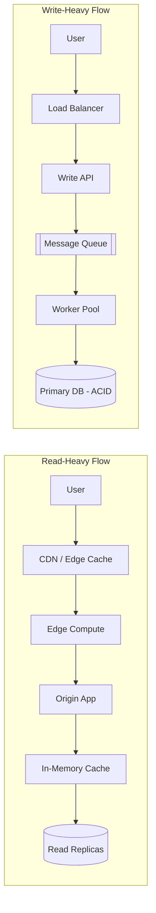

Every failed system I have ever inherited had the same origin story: someone opened an IDE before they opened a whiteboard. They picked Postgres because a blog said so. They reached for Redis because it was on a résumé. They shipped microservices because a conference talk sounded compelling.

**None of them defined the workload first.**

The previous post in this series covered the *product* side of that discipline (users, the critical path, and MVP scope). This post covers the *data* side: even with a perfectly scoped MVP, the read-versus-write shape of your critical path decides most of your architecture before you touch any code.

Architecture is not a taste preference. It is a direct response to how your system will be *read from* and *written to*. Get that wrong and every dependency downstream (the database, the cache, the queue, the deploy topology) is wrong with it. No refactor saves you from a workload mismatch. You rewrite, or you tolerate the pain forever.

{/* truncate */}

This post is about the step every team skips: **defining the workload before writing a line of code.**

## The Read-Heavy Workload

A read-heavy workload is any system where **reads outnumber writes by at least an order of magnitude**, and where the *same* data is served to many consumers.

Think product catalogs. News feeds. Documentation portals. Public APIs powering search results. Marketing pages during a Super Bowl ad.

The defining property is not just volume. It is **repetition**. The same query, the same row, the same asset, requested thousands of times per second by users who do not care whether the data is 200 milliseconds stale.

If that describes your system, your architecture priorities are non-negotiable:

- **Push the data as close to the user as possible.** That means a CDN in front of every static asset and, when the data model allows it, in front of API responses too. Every kilometer of network you eliminate is latency you never have to optimize later.
- **Use edge compute for personalization.** When responses need light shaping (auth, geo, A/B variants), do it at the edge. Do not round-trip to your origin for a header rewrite.
- **Layer your caches.** Browser cache → CDN → reverse proxy → in-memory application cache → database query cache. Each layer absorbs load the next one never sees. Skipping a layer is not "simpler." It is expensive.
- **Denormalize on purpose.** Read-heavy systems earn their speed by *pre-computing* the answer. Materialized views, cached joins, and read replicas are features, not hacks.

The database is almost never your bottleneck in a read-heavy system. **The network is.** Architect accordingly.

## The Write-Heavy / Transactional Workload

A write-heavy workload is any system where **correctness of state matters more than latency**, and where multiple writers can touch the same record.

Think payments. Inventory. Ledgers. Booking systems. Order pipelines. Anything where two users clicking "buy" on the last unit must produce exactly one winner.

The defining property here is not volume. It is **contention**. Two writes racing for the same row is where systems die quietly, then loudly, then in a postmortem.

Your priorities flip entirely:

- **ACID is not optional.** If you are moving money, counting stock, or issuing IDs, you need a database that gives you real transactions. "Eventually consistent" is a marketing phrase that becomes a lawsuit when applied to the wrong domain.
- **Row-level locking and serializable isolation are tools, not overhead.** Understand your database's isolation levels. Know when you need `SELECT ... FOR UPDATE`. Know what a phantom read is *before* you ship the checkout flow.
- **Absorb spikes with a queue, not with more replicas.** Write throughput does not scale by adding read replicas. It scales by *smoothing*: putting a durable message queue (Kafka, SQS, RabbitMQ) between the burst and the database, and letting workers drain it at a rate the database can sustain.
- **Idempotency is a first-class requirement.** Every write endpoint accepts a client-generated key. Retries must be safe. Networks fail; your correctness cannot.

CDNs and edge caches are irrelevant here. **The database is the system.** Everything else exists to protect it.

## The Two Flows, Side by Side

Before writing code, draw this. If you cannot draw it, you do not understand the workload yet.

Notice what is *missing* from each side. The read-heavy flow has no queue. The write-heavy flow has no CDN. That is not an oversight. It is the point. **Every component you add must earn its place by serving the workload.** Anything else is résumé-driven development.

## Using AI Without Getting Generic Advice

Type "I want to build an e-commerce app, what architecture should I use?" into any AI assistant and you get microservices, React, and Node.js. That answer is true for zero real teams, because it accounts for zero real constraints.

Move context in front of the question. Force the model to reason about *your* workload, not the average one.

**Weak prompt (produces boilerplate):**

> I want to build an e-commerce app. What architecture should I use?

**Structured prompt (produces something you can actually use):**

> **Role:** Senior Software Architect.
> **Context:** I am designing a system from scratch for [App Description]. The team size is [X] developers. Expected traffic is [X] users/month.
> **System Dynamics:** The app is mainly [Read-Heavy / Write-Heavy] because users will [Primary Action].
> **Task:** Analyze the workload profile. Identify the top 3 architectural bottlenecks we will face and suggest a high-level system boundary layout (e.g., Monolith vs. Services).
> **Constraints:** Do not mention specific programming languages yet. Focus purely on data flow and system constraints.

Four things happen in the structured version that never happen in the weak one: a role biases the model toward experience, a context block gives it real numbers, an explicit workload profile removes ambiguity, and a constraints line stops it from reaching for its favorite framework.

Same model, same day, radically different output. That gap is what "using AI well" actually means.

## The Rule

Before you pick a database, before you pick a framework, before you draw a single box, answer two questions in writing:

1. **What is the read-to-write ratio, and is it uniform or bursty?**
2. **When two operations collide, what is the correct outcome?**

If you cannot answer both, you are not ready to build. You are ready to plan.

Every system worth shipping starts here. Not with code. Not with a stack. With the workload.
