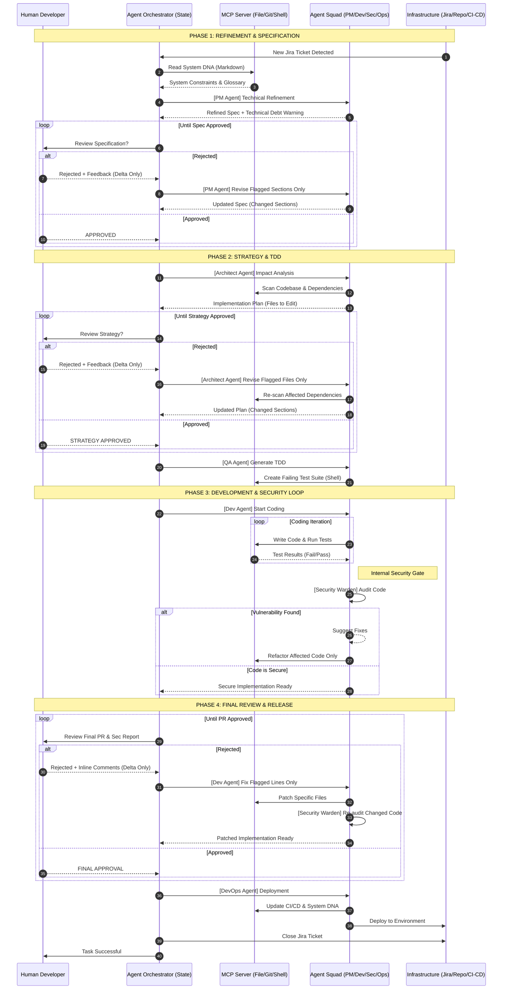

I built this workflow in December 2025, ran it against my own development work through the first half of 2026, and it is now the single most valuable piece of tooling on my machine. This post is the whole design, the reasoning behind each choice, and the specific patterns you can lift into your own agent setup even if you never adopt the whole system.

The industry conversation about coding agents is stuck between two bad extremes: "let the agent do everything" (which ships incidents) and "agents are toys" (which misses the productivity ceiling). This design is neither. It is a strict, phase-gated pipeline where agents do the boring work, a human owns every architectural decision, and no code reaches production without passing gates that catch the failure modes agents reliably introduce.

If you have read the earlier posts in the series about the [blind-paste antipattern](/ai-copilot-discipline), the [vibe-coding autopsy](/vibe-coding-autopsy), or [when to close the tab on AI](/what-ai-is-worse-than-useless-at), this is the system I use to *avoid* every failure mode those posts describe.

{/* truncate */}

## The Sequence Diagram

Here is the actual workflow. Every arrow is a real message passed by real agents in a real pipeline. Read it, then read the reasoning that follows.

## The Five Actors

Before the phase walkthrough, the roles. Every pipeline decision comes back to which actor owns what.

**Human Developer.** The only actor that makes architectural or product decisions. Reviews at three gates (spec, strategy, PR). Never edits agent outputs directly. Feedback is always delta-only: "these three sections are wrong, here is why." The human is the judgment layer, not the labor layer.

**Agent Orchestrator (State).** The pipeline itself. Holds the state of the ticket, decides which agent runs next, enforces the phase gates. Does not write code. Does not make judgments. Its job is exactly the job humans are worst at: managing a long, structured process without skipping steps.

**MCP Server (File / Git / Shell).** The [Model Context Protocol](https://modelcontextprotocol.io) server that gives agents access to the filesystem, git, and shell. Every filesystem read, every command executed, every git operation goes through here. Critical: the MCP layer is where you enforce sandboxing. Agents cannot directly touch anything outside what MCP exposes.

**Agent Squad.** Five specialist agents, each with a narrow job:
- **PM Agent** turns tickets into technical specs.
- **Architect Agent** produces implementation plans (files, dependencies, sequencing).
- **QA Agent** writes the failing test suite before any code exists.
- **Dev Agent** writes code against the failing tests.
- **Security Warden Agent** audits Dev Agent's output before it reaches a human.
- **DevOps Agent** handles deploy and updates System DNA.

**Infrastructure.** Jira, the git remote, CI/CD. Where the work originates and where the work is delivered.

## Phase 1: Refinement & Specification

**Trigger:** a new Jira ticket appears.

**What happens:** the orchestrator reads the codebase's **System DNA** (see below), passes it to the PM Agent along with the raw ticket, and asks for a technical specification.

**System DNA is the pattern worth stealing.** It is a single markdown file at the root of every service (`SYSTEM_DNA.md`) that contains:
- Domain glossary (what does "reservation" mean? what does "customer" mean? what is a "hold"?)
- Schema semantics (this table is soft-deleted via column X, that column is nullable but semantically means Y)
- Non-obvious invariants (all monetary math is in cents, all dates are stored UTC, all events emit through the audit wrapper)
- Team conventions (naming, error handling, logging style)

Every agent prompt loads System DNA. That single file is the difference between "the agent generates plausible-looking wrong code" and "the agent generates code that follows our conventions." It is also the artifact I wish every team had built two years ago, agents or no agents.

**Delta-only feedback.** If the human rejects the spec, they highlight specific sections with specific complaints. The orchestrator does not send the whole doc back to the PM Agent. It sends only the flagged sections with the specific feedback. The agent revises only those sections. The rest of the doc is untouched.

This is the second pattern worth stealing. Traditional "regenerate the whole document" agent workflows produce drift: fixing one thing accidentally changes three others. Delta-only feedback keeps the reviewed-and-approved content stable while iterating on the problem areas.

## Phase 2: Strategy & TDD

**Trigger:** the human approves the spec.

**What happens:** the Architect Agent scans the codebase (through MCP), identifies every file that will need to change, notes dependency implications, and produces an implementation plan. The human reviews and (again with delta-only feedback) approves.

Once approved, the QA Agent writes a **failing test suite** for the requirement, before any implementation code exists. The tests encode the requirement in a language the Dev Agent has to satisfy.

Two things this phase does that most agent workflows skip:

**Impact analysis before implementation.** The Architect Agent is not writing code. It is writing a list of files and reasons. This is what allows the human to actually review the strategy: it is short, structured, and about *scope*, not syntax.

**Test-first, always.** The QA Agent writes tests before the Dev Agent writes code. This is a hard constraint. If the QA Agent cannot express the requirement as a test, the requirement is not well-defined enough to implement. This has caught malformed specs three times more often than my previous non-TDD workflows.

## Phase 3: Development & Security Loop

**Trigger:** the failing test suite exists.

**What happens:** the Dev Agent iterates until the tests pass. Each iteration: write code, run tests, read the failures, adjust. All through MCP. All logged.

**The internal security gate is the third pattern worth stealing.** Before the code reaches the human for review, the Security Warden Agent audits it. This is an agent-to-agent handoff. The Security Warden is a separate agent with its own prompt, its own context, and its own criteria (auth checks, injection safety, crypto usage, secret handling, common OWASP failures).

If the Security Warden flags something, the loop happens *inside the agent squad*, not with the human. Dev Agent gets specific feedback, fixes the specific issue, Security Warden re-audits. Only when the code passes both the tests AND the security audit does it escalate to the human.

This has two effects. First, humans stop seeing PRs with obvious security bugs, which means human review time is spent on things only humans can catch (architecture, product intent, subtle logic). Second, the Security Warden's prompt is a living document that captures every security failure the team has ever seen. It gets better over time in a way individual reviewers cannot.

## Phase 4: Final Review & Release

**Trigger:** Security Warden approves.

**What happens:** the orchestrator opens a PR with the code, the test suite, and the security report. The human reviews. If they approve, DevOps Agent deploys and updates System DNA. If they reject, the loop is the same delta-only pattern as Phase 1 and 2: flagged lines get fixes, the Security Warden re-audits the patch, back to the human.

**DevOps Agent updates System DNA.** This is subtle but critical. If the change introduced a new convention, a new invariant, a new naming pattern, System DNA gets updated in the same PR. This is how the codebase's canonical docs stay in sync with the codebase itself. Without this step, System DNA rots and the whole workflow degrades within a month.

## Patterns Worth Stealing Individually

You do not have to adopt this whole workflow to steal its best ideas. Any one of these is a serious improvement to a typical agent setup.

**System DNA.** Even without agents, a single markdown file per service that documents conventions, glossary, and invariants pays for itself the first time a new engineer joins. With agents, it is transformative. This is the single highest-leverage thing you can do this week.

**Delta-only feedback.** Whether your "agent" is Cursor, Copilot, Claude Code, or a custom pipeline, feedback should specify the flagged sections and let the model revise only those. Regenerating whole documents wastes tokens and introduces drift. This is a habit change, not a tooling change.

**Internal security gate.** Even without a formal Security Warden agent, running a separate prompt whose only job is "audit this code for security issues" before opening the PR catches a category of bugs that human review consistently misses. It is one extra prompt. It costs pennies. It is worth it.

**Human-in-the-loop only at strategic gates.** Spec, strategy, and final PR. Not every intermediate step. Humans are not error correctors for agent implementations; they are decision makers for direction. Every intermediate handoff to a human is a waste of the human's judgment.

**MCP for all tool access.** If you are letting agents touch the filesystem directly instead of routing through MCP or an equivalent, you have no audit log, no sandbox, and no ability to swap the tool layer later. This is the infrastructural investment nobody wants to make until they need it, at which point they need it badly.

## What This Actually Gave Me

Concrete outcomes from running this workflow on real work through the first half of 2026:

- **Tickets close faster.** A ticket that used to take 3 to 5 hours of my hands-on time now takes 30 to 60 minutes of review time. The pipeline runs in the background while I do other work.
- **Security issues do not reach my PRs.** The Security Warden has caught seven serious issues that would have shipped otherwise (three auth bypasses, two secret leakage patterns, two injection sites). Zero of them reached my review inbox.
- **System DNA is the second-most-valuable file in the repo.** Every new hire reads it first. I read it when I forget my own conventions. Agents load it every time.
- **My skills stay sharp.** Because the human role is judgment and architecture (not implementation), I still spend time thinking about hard problems. The [senior trap](/junior-trap-senior-trap) does not apply because the boring work being delegated is boring work I did not need to keep doing anyway. The interesting decisions still land on my desk.

## Where This Does Not Apply

Be honest about limits.

- **Novel debugging.** The workflow assumes the requirement is understood. When the requirement is "figure out why production is doing something weird," you close the workflow and open a terminal. See [when to close the tab on AI](/what-ai-is-worse-than-useless-at).
- **Architectural decisions.** Agents cannot decide whether you should use a message queue. Humans decide. Agents implement.
- **Legacy code archaeology.** Codebases without a real System DNA cannot benefit from this workflow yet. The first job in adopting the workflow on a legacy codebase is *writing* the System DNA, which is a multi-week project.
- **Small teams without infrastructure.** MCP servers, orchestrators, and CI hooks are real infrastructure. Solo devs can approximate this manually. Teams over 10 people benefit most.

## How to Start

If you want to adopt any of this, adopt it in this order:

1. **Write System DNA for one service.** One markdown file. Glossary, schema semantics, non-obvious invariants, conventions. This alone changes how your AI assistant behaves on that codebase.
2. **Add a security-audit prompt to your workflow.** Before you open a PR, run one prompt whose only job is to audit the diff for common security failures. Log the results in the PR body.
3. **Switch to delta-only feedback.** When your assistant produces a document you partially reject, feed back only the flagged sections. Do not regenerate the whole thing.
4. **Formalize your gates.** Decide which decisions are humans-only, which are agents-only, and which are shared. Write it down. Do not let the boundary drift.
5. **Only then consider a full orchestrator.** The infrastructure is significant. Do not build it until steps 1 through 4 are habits.

## Closing

The agentic hype cycle is producing two kinds of teams. The ones that use agents badly ship incidents faster than they can debug them. The ones that use agents well ship the same quality of work with less friction, and their engineers stay sharp because the delegated work is genuinely delegable.

The difference is not the model. It is not the framework. It is not the vendor. It is the discipline of the workflow around the model.

This workflow is one version of that discipline. It is not the only version. Steal what fits, discard what does not, and build the version that fits your team. Just do not skip the step where you write the discipline down. That is the step that separates a productive agent workflow from a very expensive way to generate bugs.
