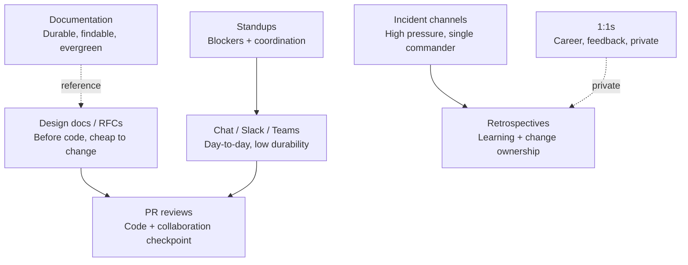

The most underrated career skill in software engineering is the ability to _work with other engineers_ without breaking the working relationship, the codebase, or your own reputation. Everyone gets taught how to write code. Almost nobody is taught how to have the conversation around it. Not the loud parts (arguing in a PR thread, disagreeing in a design review); not the quiet parts (writing decisions down so people who missed the meeting can catch up, closing a chat thread instead of leaving it half-answered).

That conversation, spread across seven or eight different surfaces where teams actually communicate, is where most engineering organizations silently succeed or fail. Not in the code. In the design doc that never got written. In the meeting where the loudest engineer's opinion became "the plan." In the PR thread that turned into a two-day argument. In the incident channel where nobody knew who was actually driving. In the retro where the same problem got named for the fourth quarter in a row and nothing changed.

This post is about that layer: the humans, the surfaces they communicate on, and the practices that keep collaboration from turning into combat. It sits next to [What I Actually Look for in a Code Review](/code-review-what-i-look-for), which is about the code inside a diff. This one is about _everything else_ that happens between engineers on a working team.

{/* truncate */}

## The Vocabulary Before Anything Else

If your team disagrees about what a "nit," a "blocker," or a "decision" means, you'll have vocabulary fights disguised as engineering fights. Nail these down.

**Sync vs async.** Sync is real-time (a call, a huddle, a whiteboard). Async is written and readable later (a doc, a thread, a PR comment). Sync is high-bandwidth and low-durability; async is lower-bandwidth and much higher-durability. Every team fight about "we need more meetings" or "we're in too many meetings" is really a fight about which decisions belong in which mode.

**Design doc (RFC).** A written proposal for a non-trivial change. Names the problem, the proposed approach, the tradeoffs, and the alternatives considered. Reviewed _before_ code. The moment where a design is cheap to change.

**Standup.** The daily sync ceremony. Ideally short, focused on _blockers and coordination_, not status.

**PR review.** The code-level checkpoint. Both the technical review (see the code review post) and the collaboration surface where disagreement about _how the team wants to build_ becomes concrete.

**Incident channel.** The temporary chat channel spun up during an outage. High pressure, high stakes, high need for a single incident commander so decisions don't fork.

**Retrospective.** The after-the-fact meeting that asks: what happened, what should we change, and who owns the change. Only useful when the change actually happens.

**1:1.** The private conversation between engineer and manager (or engineer and mentor). Not a status meeting. Where career, feedback, and things-that-don't-belong-in-Slack get talked about.

**Disagree-and-commit.** A pattern where, after a decision is made, everyone (including dissenters) commits to executing it fully, and the dissent gets recorded in the doc, not sabotaged in the execution. Powerful when honestly practiced; weaponized when used to silence dissent up front.

**Escalation.** Bringing a third person into a stuck conversation, with a specific question and both positions honestly represented. Not a failure signal.

**Nit / suggestion / blocker.** Review-specific labels. Nit is optional. Suggestion expects a response. Blocker must be addressed before merge.

**LGTM.** _Looks good to me._ Should mean _"I read this and I stand behind it merging."_ When "LGTM" degrades to a rubber stamp, code review has stopped functioning as a check.

If those terms mean the same thing across the whole team, you've eliminated 30% of collaboration friction before it starts.

## The Surfaces Where a Team Actually Communicates

Engineers usually assume that "how we communicate" is one thing. It isn't. A working team communicates across at least seven distinct surfaces, each with its own norms, its own failure modes, and its own reasonable defaults. Most collaboration breakdowns are actually _surface mismatches_: a conversation that belonged on one surface got forced onto another.

Here's what "good" looks like on each surface, in one paragraph each.

**Design docs / RFCs.** Written _before_ code for anything non-trivial. Names the problem, the proposed approach, the alternatives considered, and the tradeoffs. Reviewed by the people who will maintain the system, not just the person who will build it. The point isn't to make design formal; it's to make disagreement about design _cheap_, before it's baked into three thousand lines of code that are hard to unwind.

**Chat (Slack, Teams, Discord).** Day-to-day questions, quick coordination, casual pinging. Fast, low durability, terrible as a source of truth. Rule of thumb: if a decision gets made in chat, the decision needs to move to a doc, a ticket, or a PR description within an hour, or it's effectively lost. Threads keep signal from drowning in noise. DMs are for private, not for hiding decisions from the team.

**Standups.** Short. Blockers and coordination first, status a distant second. If your standup is thirty minutes of everyone reciting what they did yesterday, it has become status theater; kill it or reshape it. The one signal a standup should surface is _"who needs help today,"_ and that signal is worth the ceremony.

**PR reviews.** The concrete daily surface where the team's working culture becomes visible. Where "how we build here" gets negotiated one comment at a time. Where a lot of collaboration goes right or wrong on public display. The rest of this post drills into this surface specifically because it's where conflict is most concrete and where the biggest daily costs live.

**Incident channels.** Temporary, high-pressure, high-stakes. Rules different from every other surface: single incident commander, decisions announced not debated, updates posted on a cadence, timeline preserved for the postmortem. The failure mode is "everyone freelances," and it's how one-hour incidents turn into three-hour ones.

**Retrospectives.** After incidents, after quarters, after milestones. The point is _change_, not commiseration. A retro that names problems and doesn't produce owned actions is a support group. A retro that names the same problems every quarter without change is worse than not doing them, because it teaches the team that their voices don't move anything.

**1:1s.** Private, one-to-one, usually engineer-and-manager. Not a status meeting. What belongs here: career, feedback in both directions, things the engineer can't say in a group setting, things the manager can't say in a group setting. If your 1:1 has become a status report, you're leaving the actual value on the table.

**Documentation.** The evergreen surface. Runbooks, architecture overviews, onboarding guides. The failure mode is _out-of-date documentation_, which is worse than no documentation because it misleads. Owned docs, dated docs, deleted-when-stale docs.

## The Wrong Ways Teams Collaborate

Broad anti-patterns that show up across most of these surfaces. Every team has done some of these; the goal is to name them so they can be interrupted.

**Meeting-driven decisions with no written trace.** A group makes a call in a meeting. Nobody writes it down. Three weeks later, half the team remembers the decision one way, half remembers it another way, and there's a Slack argument about "what we agreed." The fix is a one-paragraph decision note in a doc or ticket, posted within an hour of the meeting ending. _If it's not written down, it didn't happen._

**Chat as the source of truth.** Important decisions live in Slack threads that scroll off. New joiners can't reconstruct anything. Six months later, "why do we do it this way" has no answer, because the thread that decided it aged out of the retention window. Chat is for coordination; docs and PR descriptions are for truth.

**Silent disagreement.** Engineer disagrees with a design in the review meeting. Says nothing. Goes back to their desk, complains in DM to a peer. Comes to review the PR, still says nothing, approves reluctantly, and mentions the concern for the first time in the post-incident retro three weeks later. The fix is a norm that says: _raise the concern where the decision is being made, in writing if you can, once, clearly, then either commit or escalate._ Silent disagreement is the most corrosive team pattern, because the disagreement is real and it never gets addressed.

**PR review as the first time a design is discussed.** By the time the PR is up, the author has invested days. Any substantive design pushback at that point is expensive to act on and feels personal. If the change is big enough to warrant design pushback, it was big enough to warrant a design doc first. The reviewer who first raises the design concern in the PR review isn't wrong to raise it, but the team failed one step earlier.

**Escalation without escalation.** An engineer disagrees with a peer. Goes to their manager. Manager decides. Peer finds out via the decision, not the escalation. Now the peer thinks their coworker went behind their back, because the coworker did. The fix: escalate _openly_. "I don't think we're going to agree, I'd like to bring in X to break the tie" is a legitimate move. Going around someone quietly is not.

**Retros as blame theater.** The retro names people instead of systems. Whoever's least defended that quarter takes the fall. Nothing changes structurally. Everyone learns that raising real problems in retros is dangerous, and next quarter's retro is quieter and less useful.

**1:1s as status meetings.** The one hour a month where the engineer could actually talk about career, feedback, or something they can't say in a group setting becomes another status update. Both sides leave feeling like they've been polite for an hour. Multiply by two engagement drops per quarter and you have an attrition problem you can't explain.

**"Async by default" used to avoid decisions.** Every decision punted to an async doc that nobody reads, so the decision never actually gets made and the team drifts. Async is a superpower for _durable_ communication; it's a failure mode when it becomes the excuse for never converging on a call. Some decisions need a thirty-minute meeting. Take the meeting.

## PR Review, Zoomed In

Every one of the surfaces above matters. PR review deserves a section of its own because it's the most concrete daily surface, the one every engineer touches, and the one where conflict is loudest.

### The wrong ways to review

The reviewer-side anti-patterns.

**The nitpick storm.** Fifteen cosmetic comments, zero blockers. The PR looks red-hot, but no substantive review happened. Author either loses trust in the reviewer's judgment or robotically applies everything. Neither improves the codebase.

**The drive-by rewrite.** _"I would have done this differently. Here's a rewrite."_ Mid-review, the reviewer proposes an alternative that would take three days to adopt. Reviews should sharpen the design the author committed to, not restart it. If the design is wrong, that was a pre-PR conversation, not a review comment.

**The ego review.** _"This is not how I would have done it."_ Terrible framing. Name the _principle_ (readability, testability, correctness), or keep it out of the thread.

**The silent approval to avoid conflict.** Reviewer sees a real problem, weighs the cost of raising it, clicks Approve. This is the single most damaging review behavior. It looks like collaboration and functions like abandonment.

**The dead review.** Sits open for a week. Author blocked. Reviewer "been busy." No unassign, no signal. A specific form of ghosting that quietly kills team velocity.

**The "one more thing" review.** Each round introduces new asks not raised on round one. Six rounds in, the PR is exhausted. Reviewers should batch: read the whole diff, list everything, send once.

### The wrong ways to receive review

The author-side anti-patterns.

**Defensiveness on every comment.** Three-paragraph defenses of a two-word ask. If you spend more effort defending than the reviewer spent commenting, you've lost the plot.

**Silent rewrite.** Pushing new commits without responding to comments. Reviewer has no idea whether the input mattered. Reply to threads, even with "applied."

**Ghosting.** PR sits with unaddressed comments for two weeks. The mirror of the dead review; equally corrosive.

**Arguing about the reviewer instead of the code.** _"You always nitpick my PRs."_ Belongs in a 1:1, not a PR thread. Once the argument is about _who_ is reviewing rather than _what_, the review is over.

**Merging past unresolved blockers.** Admin bypass over Request-Changes. Rare, dramatic, almost always ends up in someone's retro.

**Force-pushing over the reviewer's comments.** Rewriting history mid-review so the reviewer can't see the state they commented on. Hostile. Push additional commits during review; squash on merge.

## The Eight "I'm Just Being Professional" Traps

The false-safety patterns specific to team collaboration. Every one is common. Every one erodes trust while feeling reasonable at the time.

### Trap 1: "I'm just being direct"

**The claim.** _I don't hedge. I say what I think. That's professional._

**Why it's misleading.** Directness without framing is often just curtness. "This is wrong" and "this is going to break under retries because the outer transaction commits before the inner one settles" say the same thing. Only one of them lets the author fix the bug without feeling attacked. "Direct" is a good goal; "curt" is not the same thing, and mistaking one for the other is how blunt engineers develop reputations they don't want.

**The fix.** Say the thing. Also say why. The extra sentence is the difference between comments that get engaged and comments that get argued with.

### Trap 2: "It's just a nit, but..."

**The claim.** Softening a real ask by calling it a nit.

**Why it's misleading.** If it's actually a nit, the author is free to ignore it. If the reviewer would be unhappy if it were ignored, calling it a nit is passive-aggressive labeling. Confused authors either change everything (slowing review) or ignore everything (angering the reviewer).

**The fix.** Nit means nit. If you want a change, say "suggestion" or "please change." If it's genuinely optional, say "take it or leave it." Precision in labels is a gift to the author.

### Trap 3: "LGTM" as a rubber stamp

**The claim.** Approving without reading, because the author is trusted, or the CI is green.

**Why it's misleading.** LGTM is a load-bearing signal. Future auditors, incident responders, and the author themselves treat approvals as evidence someone competent read this. When approvals stop meaning that, review has become theater.

**The fix.** Never approve a diff you haven't read. If you don't have time, unassign yourself. "I'm out today, please reassign" is a reasonable response. Skimmed LGTMs on 400-line diffs are not.

### Trap 4: "That's bikeshedding" used to silence real concerns

**The claim.** Dismissing a comment by calling it trivial.

**Why it's misleading.** Bikeshedding is real, and it's also the most common shutdown weapon in code review. What gets labeled bikeshedding is often a genuine concern the reviewer doesn't want to address: a naming inconsistency, a subtle failure mode, an API shape that will hurt callers.

**The fix.** If you think a comment is bikeshedding, say _why_ the substantive impact is low. "This name is fine because it matches the rest of the module" is a real answer. "That's bikeshedding" alone is a rhetorical move, not a technical one.

### Trap 5: "We already discussed this"

**The claim.** Shutting down a reopened topic by pointing back to a prior conversation.

**Why it's misleading.** Sometimes true, sometimes an excuse. If the prior conversation was written down in a doc or a decision note, "we already discussed this, see [link]" is a legitimate close. If it was a conversation in a meeting with no written trace, "we already discussed this" is a claim the other person has no way to verify. New joiners, in particular, are structurally shut out by this phrase.

**The fix.** Write decisions down. Then "we already discussed this" comes with a link, not a memory.

### Trap 6: "We can fix it in a follow-up"

**The claim.** Deferring a comment to a future PR.

**Why it's misleading.** "Follow-up" is honest as often as the ticket actually gets prioritized. In most teams, that's rarely. The debt ticket ages, gets rewritten as "won't fix," and the concern silently loses.

**The fix.** Two honest variants: (1) the reviewer opens the follow-up ticket right now, links it in the thread, confirms it's on the next sprint. (2) The change is trivially small, truly independent, and the author commits to the follow-up PR before end of week. Anything vaguer is "we're not going to fix this" with better packaging.

### Trap 7: "This isn't the hill to die on"

**The claim.** _I have a concern, but I'll let it go._

**Why it's misleading.** Yielding once is fine. Yielding every time turns you into someone whose opinions have no cost, which means future concerns get discounted. The team culture drifts: the loud engineers set the standards; the thoughtful ones become invisible.

**The fix.** Have a rough budget. If you have three legitimate concerns, raise at least two, even knowing one will get pushback. Pick the ones with the biggest downstream cost. The point isn't to win; it's to remain someone whose "yes" and "no" both carry weight.

### Trap 8: "Just approve it, we're behind"

**The claim.** Velocity pressure used as an argument to skip depth.

**Why it's misleading.** Almost every incident postmortem contains a line that reads _"the PR was approved quickly due to end-of-sprint pressure."_ "We're behind" is a persistent state on many teams, not an occasional one. Every time it wins, the safety net gets thinner.

**The fix.** Say the schedule cost out loud. _"If I do a deep read, this lands tomorrow instead of today. Is that ok?"_ Nine times out of ten the honest answer is yes. If it's genuinely no, that's a conversation with the team lead, not a reason to lower the bar.

## The Method: How to Disagree Without Breaking Trust

The disagreement itself is neutral. How it's expressed determines whether the team gets sharper or gets bruised. Same method applies in a PR thread, a design review, a chat thread, or an incident channel.

### Separate the code (or the decision) from the person

The comment is about the code, not the author. _"This function is doing three things and would be easier to test if it did one"_ is about the code. _"You keep writing functions that do three things"_ is about the person. The first invites a fix; the second invites a defense. Even when the pattern is repeated, keep the comment scoped to _this diff_.

### Ask a question before making a claim

_"What happens if the outer transaction rolls back after the inner one commits?"_ is a better opener than _"this is broken."_ The question gives the author room to either explain (in which case you learn) or realize the bug (in which case they fix it and thank you). The claim, even when correct, puts the author in defensive posture on read one.

### Name the principle, not the preference

_"I'd prefer if..."_ is weak framing. _"Readers of this module have to trace three files to find the invariant; can we colocate the check with the type?"_ names why the change matters. The principle turns a preference into a defensible position; your opinion is no longer the load-bearing element.

### Offer the alternative in code, not just prose

When suggesting a substantive change, write the version you'd prefer, in the comment, as code. Prose is easy to dismiss. Code that compiles either matches the surrounding style or has a specific bug you can point to. It also signals that you took the time to think through the alternative, not just object to the current one.

### Timebox the debate

Six back-and-forths in one thread means the disagreement isn't going to resolve inline. Two options: one side concedes with a written reason, or escalate to a third opinion. Long threads are almost always a sign that the debate needs a different format (a call, a doc), not more comments.

### Know when to escalate

Escalation isn't failure. It's a tool. When two engineers genuinely disagree on something with downstream cost, bringing in a tech lead or subject-matter expert with a specific question resolves the debate in one round. The escalation should:

- Name a specific person, not a group chat.
- Ask a specific question with a yes/no or A/B answer.
- Include both positions honestly, not just yours.

Both original participants own the final decision. The escalated person offers evidence, not adjudication.

## The Team Communication Contract

Every team should have these written down somewhere. Explicit contracts prevent the "I thought that was your job" argument that shows up in every conflict.

**Decisions**

- Every non-trivial decision has a written trace: a doc, a decision note, a linked ticket, a PR description. If it's not written down, it didn't happen.
- Design docs are the default for anything non-trivial. Reviews happen before code, not after.
- Async is the default for anything durable. Sync is for things that need convergence in one hour.

**PR reviews (reviewer side)**

- Label every comment: nit, suggestion, or blocker.
- Don't rewrite the design in a review. If the design is wrong, back to design doc.
- Respond to review requests within the team SLA (usually one business day). If you can't, unassign yourself.
- Read the whole diff before commenting.
- Approvals mean you stand behind the merge.

**PR reviews (author side)**

- Respond to every non-nit comment: agree, disagree with reason, or defer with a linked follow-up.
- Never silently rewrite over open threads.
- Don't merge past unresolved blockers.
- Keep the PR reviewable: small, focused, with a description that names the change and the tradeoffs.

**Chat**

- Decisions in chat get moved to a doc or ticket within the hour.
- Threads for anything that isn't a one-liner.
- DMs are for private, not for hiding decisions from the team.
- Async first; if a thread has ten back-and-forths, jump on a call.

**Standups, retros, 1:1s**

- Standups: blockers first, coordination second, status only if asked.
- Retros: every named problem gets an owned action or gets recorded as "known and accepted."
- 1:1s: not status. Career, feedback, and things that can't be said in a group.

**Incident channels**

- One incident commander. Announced explicitly at the top of the channel.
- Decisions announced, not debated (debates happen in the postmortem).
- Status updates on a cadence, timeline preserved.

**Disagreement**

- Raise concerns in the room where the decision is being made, in writing if possible.
- Disagree, then commit; don't sabotage in execution.
- Escalate openly, with a specific question and both positions represented honestly.

Print it, paste it in the team wiki, review it every six months. When a conflict starts, one side is usually violating a clause. Naming the clause is often faster than arguing about the specific incident.

## When Conflict Is Actually Valuable

Not every disagreement should be smoothed over. A team where reviews and design discussions never generate disagreement is not a team with great taste; it's a team where review has stopped mattering, or where the culture has taught engineers not to raise concerns. Both are worse than a team that argues productively.

The disagreements worth having:

- **Tradeoff disagreements.** _"Is this the right latency-vs-consistency call?"_ Both sides can be defensible; the discussion sharpens which one this system actually needs.
- **Invariant disagreements.** _"Is null-safety here worth the complexity?"_ Naming the invariant explicitly is often more valuable than the answer either side lands on.
- **Interface disagreements.** _"Does this API shape hurt the caller?"_ Interfaces are hard to change later; the argument at design time is cheap compared to the alternative.
- **Priority disagreements.** _"Should this ship before or after the migration?"_ Sequencing decisions have compounding effects; disagreeing openly beats agreeing quietly and re-litigating later.

A team that regularly has short, respectful, well-labeled disagreements about tradeoffs, invariants, interfaces, and priorities is a team building sharper systems and growing its engineers at the same time. A team that never has those disagreements is a team that ships whatever the loudest voice wants, then debugs the consequences.

## The AI Co-Pilot Prompt for Hard Conversations

AI is genuinely useful _for drafting the reply, not for having the opinion_. The point is to keep responses firm, neutral, and grounded in principle, especially when the human draft would be defensive, curt, or apologetic. Works for PR replies, escalation notes, disagreement in a design thread, retro comments, and 1:1 preparation.

**Weak prompt (produces mush):**

> Help me respond to this politely.

**Structured prompt (produces something worth sending):**

> **Role:** Senior engineer helping me draft a reply on [PR / design thread / retro / escalation note].
> **Context:** The other party said [pasted]. My honest position is [pasted]. My relationship with them is [collaborative / tense / new]. The stakes on this specific decision are [low / medium / high]. The audience is [just them / the whole thread / a wider team].
> **Task:** Draft a reply that (1) acknowledges their point specifically, (2) states my position with the principle behind it, not just my preference, (3) proposes the next concrete step: apply, escalate, open a follow-up, or defer with reason. (4) Does not hedge with softening filler ("just," "maybe," "if that's ok").
> **Constraint:** Firm, neutral, short. No emojis. No apologies unless I actually made an error. Do not pretend to agree when I don't.

The output is a first draft, not a final send. Read it, adjust to actually sound like you, and post. What the model is good at is stripping the defensiveness (or the passive-aggression) out of a draft you'd otherwise send at 6pm after a long day.

The same prompt works, inverted, when the other party has responded emotionally. Draft a reply that acknowledges their frame, restates the concern in principle terms, and proposes the next step.

## The Rule Worth Writing on the Whiteboard

**A team is a communication system that happens to ship code. Optimize the communication, and the code follows.**

The reason the same problems show up in retros every quarter is almost never that the team doesn't know how to write code. It's that the team's communication system has a bug, and the bug is invisible because nobody thinks of it as a system. Meetings without written traces, chat threads that scroll off, PR reviews that turned into arguments, incident channels that forked into three subchannels, retros that produced no owned actions, 1:1s that became status reports, design docs nobody reads until after the code lands.

Every one of those is a fixable process bug. Not a personality problem. Not a "we have a difficult teammate" problem. A process bug, in the way information moves between humans on the way to becoming code.

Fix the surfaces. Fix the labels. Fix the contracts. Say the thing, name the principle, respond to the comment, write the decision down, escalate openly, retro honestly, and never let velocity pressure win an argument against safety twice in the same quarter.

The engineers who grow fastest are the ones who take this layer seriously from day one, as an author and as a teammate. The engineers who plateau are the ones who treat "the team stuff" as somebody else's problem. The code was rarely what separated them. The conversation around it was.
