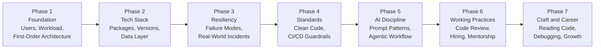

# Start Here

**How I Build** is an opinionated, blueprint-driven series about how I plan, build, and operate production systems from scratch. Every post traces back to a written framework, every recommendation names its trade-offs, and every AI-related post shows how to use assistants without letting them ship your next incident.

If you are new here, read this page first. It tells you which posts to read based on what you actually want.

## The Framework

Seven phases, in the order I actually work through them for a new system.

Each phase has its own posts, plus one or more real-world case studies where I dig into a specific incident or design decision in depth.

## Where to Start

Pick the lane that fits you.

### If you are a junior developer

Start with the phase that teaches decision-making, then work up.

1. [How I Read a Codebase I Didn't Write](/reading-unfamiliar-code). the most-used, least-taught skill in the industry.
2. [Defining the User, the MVP, and the Critical Path](/defining-users-mvp-and-critical-path). before code, define what you are building.
3. [Defining the Workload Before Writing Code](/defining-the-workload). architecture is a response to workload, not a taste preference.
4. [First-Order Architecture](/first-order-architecture-decisions). monolith vs services vs serverless, monorepo vs polyrepo, framework family.
5. [The Junior Trap and the Senior Trap](/junior-trap-senior-trap). how AI damages different seniority levels differently, and what juniors should do about it.

### If you are a senior engineer or architect

The real-scenario posts are where the framework earns its keep.

1. [Cloud Run, Cloud Armor, and the Two Infra Changes That Took Down My App](/cloud-run-cloud-armor-incident). a real platform-coordination incident, with the postmortem and the structural fix.
2. [Real-World Resilience with BullMQ, Downstream Outages, and Cross-Team Contract Drift](/real-world-resilience-bullmq-and-contracts). three production failure modes and the mitigation stack for each.
3. [Vibe Coding, Autopsy of an Incident That Should Not Have Happened](/vibe-coding-autopsy). a class of AI-assisted failure written up as a postmortem.
4. [The Agentic Development Workflow That Actually Ships Code](/agentic-development-workflow). a real multi-agent pipeline used in production, with the patterns worth stealing individually.

### If you are hiring, interviewing, or evaluating engineers

These are the posts that show how I think about the humans around the code.

1. [What I Look for When I Hire an Engineer](/hiring-engineers-what-i-look-for). the actual signals, the anti-signals, and the interview format that works in the AI era.
2. [What I Actually Look for in a Code Review](/code-review-what-i-look-for). the specific list of questions I ask on every PR.
3. [Seven Engineering Tasks Where AI Is Worse Than Useless](/what-ai-is-worse-than-useless-at). the anti-recommendation post.
4. [The AI Co-Pilot Discipline, Myths, Facts, and the Blind-Paste Antipattern](/ai-copilot-discipline). the meta-framework for using AI without letting it use you.

### If you have a specific problem right now

- **"My WAF is blocking legitimate traffic"** → [Cloud Run + Cloud Armor incident](/cloud-run-cloud-armor-incident), plus the [WAF Survival Guide](https://balangyaoejuspher.github.io/waf-survival-guide/) (separate repo, cross-provider reference).
- **"We keep duplicating code across services"** → [Duplicated Functions and Technical Debt](/duplication-and-technical-debt).
- **"Our team is arguing about microservices"** → [First-Order Architecture](/first-order-architecture-decisions).
- **"A dependency I trusted just broke us"** → [Tech Stack Evaluation and Dependency Risk Mitigation](/tech-stack-evaluation).
- **"How do we handle a third-party outage"** → [Designing for Resiliency and Failure Modes](/designing-for-resiliency).

## The Full Series

Every post, in the order the framework expects you to read them.

**Phase 1: Foundation**

1. [Defining the User, the MVP, and the Critical Path](/defining-users-mvp-and-critical-path)
2. [Defining the Workload Before Writing Code](/defining-the-workload)
3. [First-Order Architecture, Monolith vs Services vs Serverless, Monorepo vs Polyrepo, and Framework Family](/first-order-architecture-decisions)

**Phase 2: Tech Stack**

4. [Tech Stack Evaluation and Dependency Risk Mitigation](/tech-stack-evaluation)
5. [Database Schema, Naming Conventions, MySQL vs PostgreSQL vs NoSQL, and Choosing Primary Keys](/database-schema-and-naming)
6. [Auth and Identity, the Deep Version](/auth-and-identity)
7. [API Design and Versioning, Beginner to Advanced](/api-design-and-versioning)

**Phase 3: Resiliency**

8. [Designing for Resiliency and Failure Modes](/designing-for-resiliency)
9. [Real-World Resilience with BullMQ, Downstream Outages, and Cross-Team Contract Drift](/real-world-resilience-bullmq-and-contracts)
10. [Cloud Run, Cloud Armor, and the Two Infra Changes That Took Down My App](/cloud-run-cloud-armor-incident)
11. [Observability From Day One, Because You Cannot Debug What You Cannot See](/observability-from-day-one)
12. [Caching Strategy End-to-End, Beginner to Advanced](/caching-strategy-end-to-end)

**Phase 4: Standards**

13. [Coding Standards and Automated Production Guardrails](/standards-and-guardrails)
14. [Duplicated Functions and Technical Debt You Can Actually Pay Off](/duplication-and-technical-debt)
15. [Environments and Deployment Strategies, Beginner to Advanced](/environments-and-deployment-strategies)

**Phase 5: AI Discipline**

16. [The AI Co-Pilot Discipline, Myths, Facts, and the Blind-Paste Antipattern](/ai-copilot-discipline)
17. [Vibe Coding, Autopsy of an Incident That Should Not Have Happened](/vibe-coding-autopsy)
18. [The Junior Trap and the Senior Trap, How AI Damages Different Careers Differently](/junior-trap-senior-trap)
19. [Seven Engineering Tasks Where AI Is Worse Than Useless](/what-ai-is-worse-than-useless-at)
20. [The Agentic Development Workflow That Actually Ships Code](/agentic-development-workflow)

**Phase 6: Working Practices**

21. [What I Actually Look for in a Code Review](/code-review-what-i-look-for)
22. [What I Look for When I Hire an Engineer, and What Interviews Should Look Like in the AI Era](/hiring-engineers-what-i-look-for)

**Phase 7: Craft and Career**

23. [How I Read a Codebase I Didn't Write](/reading-unfamiliar-code)

## What Is Coming

The framework's initial roadmap (Phases 1 through 6) is complete. Phase 7 (Craft and Career) is now in active work: reading unfamiliar code, debugging as a discipline, PR descriptions that get read, the 30-60-90 plan, learning in year N, and giving a talk nobody sleeps through. Requests welcome via [GitHub discussions](https://github.com/balangyaoejuspher/how-i-build/discussions).
